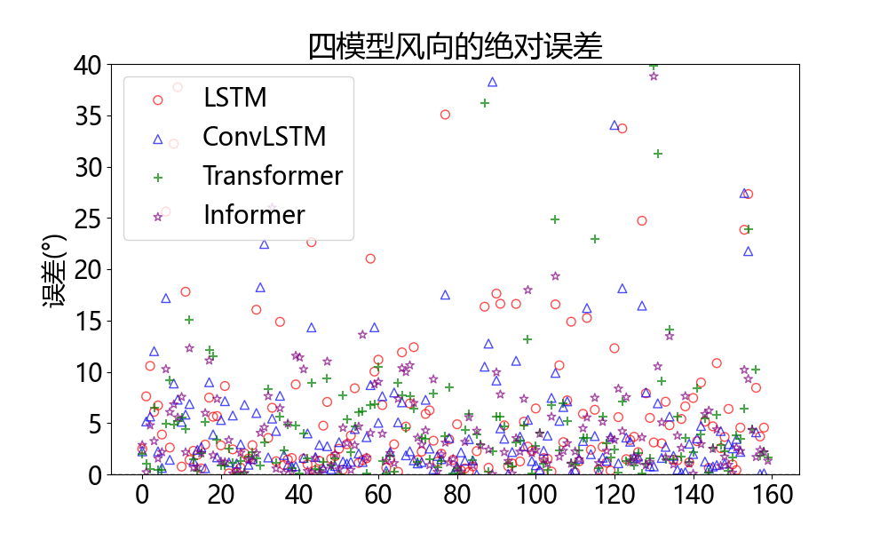

# 基于Transformer的风速风向短期预测研究(本科毕业设计)


本项目立足于综合当前深度学习的发展进程和综合分析不同的短期预测模型，在风速风向短期预测上考虑多高度风力信息，提高风向预测精度，有利于加强风能预测，提高风电利用的效率和可靠性，评估各经典深度学习模型在实际情况下预测能力和效果，为风电行业的短期数据预测提供新的参考，对跨海桥梁建设和运营等其他领域提供有价值的见解。


## 特点
- [x] 使用基于Lidar的数据提供了高时空分辨率，精度和可靠性的风测量，使其适用于风力发电预测与风电场运营管理。
- [x] 该方法包括基于向量分解、风向损失计算和风向数据特征重构，可以有效地处理与0°或360°风向不连续相关的问题。
- [x] 在多步预测和风速和风向的单高度和多高度场景下，对四种主流深度学习模型的预测性能进行了检验和比较。

本次的项目代码和模型来源参考以下文章
- [x] [LTSF-Linear](https://arxiv.org/pdf/2205.13504.pdf)(AAAI 2023)
- [x] [Informer](https://arxiv.org/abs/2012.07436) (AAAI 2021 Best paper)
- [x] [Transformer](https://arxiv.org/abs/1706.03762) (NeuIPS 2017)
- [x] [ConvLSTM](https://arxiv.org/pdf/1506.04214.pdf)
- [x] [LSTM]


## 详细说明
提供以下所有实验脚本文件
| 文件      |                              解释                          |
| ------------- | -------------------------------------------------------| 
| LSTM_v1.py      | LSTM模型实现                    |
| ConvLSTM_v1.py      | ConvLSTM模型实现   | 
| run_longExp.py        | Transformer和Informer模型入口      |
| 运行命令.txt        | run_longExp.py运行所需的命令      |
| error_result.py        | 保存模型运行误差效果      | 
| resultfig.py        | 展示模型运行的误差效果图      |


此代码只是建立在LTSF-Linear的代码库之上，非常感谢以下 GitHub 存储库的宝贵代码库或数据集：

LTSF-Linear来自https://github.com/cure-lab/LTSF-Linear

## wind-orient-prediction
### 技术路线


### 向量分解


### 风向损失计算


### 风向数据特征重构


### 时间序列数据集生成


### 4个模型之间的比较情况
#### 单高度预测：
<style>
  table {
    border-collapse: collapse;
    margin: 0 auto; /* 中心对齐 */
  }
  td {
    padding: 0;
    border: none; /* 去掉边框 */
  }
  img {
    display: block;
    margin: 0 auto; /* 图片居中对齐 */
  }
</style>

<table>
  <tr>
    <td>
      
    </td>
    <td>
      
    </td>
  </tr>
</table>

#### 多高度预测：

<table>
  <tr>
    <td style="text-align: center;">
      17层风速损失
    </td>
    <td style="text-align: center;">
      17层风向损失
    </td>
  </tr>
  <tr>
    <td>
      
    </td>
    <td>
      
    </td>
  </tr>
</table>

#### 多高度多步预测：

<table>
  <tr>
    <td>
      
    </td>
    <td>
      
    </td>
  </tr>
</table>


## 开始
### 环境要求

首先，请确保您已安装 Conda。然后，我们的环境可以通过以下方式安装：
```
conda create -n wop python=3.6.9
conda activate wop
pip install -r requirements.txt
```

### 数据准备

本文提供本次实验已经预处理好的数据，**已经在 `./data/ETT` 目录下**，更多数据的预处理情况参考论文内容。

### 训练实例
- 需要训练LSTM或者ConvLSTM，直接运行`LSTM.py`或者`ConvLSTM.py`
- 需要训练Transformer或者Informer，直接复制`运行命令.txt`，自行修改参数，在当前目录下运行即可。

### 训练情况提示
- 训练LSTM或者ConvLSTM，需要的时间在30分钟到1小时（GPU条件下）
- 训练Transformer或者Informer，需要的时间在1小时左右（GPU条件下）


## 引用

如果您发现此存储库对您的工作有用，请考虑按如下方式引用它：
```bibtex
@inproceedings{
  title={基于Transformer的风速风向短期预测研究},
  author={ZhiQing Gan},
  journal={本科毕业论文},
  year={2024}
}
```

如果您在实验中使用所有数据集和比较方法，请记住引用它们。
